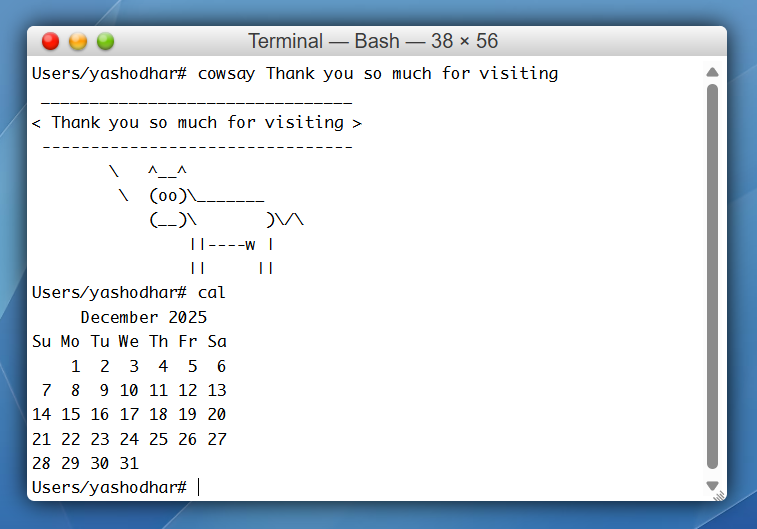

# macOS X Tiger (10.4) — Recreated in React

*A pixel-perfect, fully interactive, browser-powered operating system — recreated in React.*


This repository is a complete, working recreation of **macOS X Tiger (10.4)**. It’s not a static UI mock — it’s a functioning OS simulation you can run in the browser, with a virtual file system, multi-window management, a working Terminal, Finder, Safari (PDF viewer), Dashboard, Dictionary + Thesaurus, Mail, Spotlight, and more.

---

# Table of Contents

- [macOS X Tiger (10.4) — Recreated in React](#macos-x-tiger-104--recreated-in-react)
- [Table of Contents](#table-of-contents)
- [About](#about)
- [Highlights](#highlights)
    - [Boot Screen](#boot-screen)
- [Applications](#applications)
  - [Finder](#finder)
  - [Desktop](#desktop)
  - [Dashboard](#dashboard)
  - [](#)
  - [Mail](#mail)
  - [](#-1)
  - [Safari](#safari)
  - [Dictionary \& Thesaurus](#dictionary--thesaurus)
  - [](#-2)
  - [](#-3)
  - [Contacts](#contacts)
  - [Xcode (Viewer)](#xcode-viewer)
  - [TextEdit](#textedit)
  - [Terminal](#terminal)
    - [Supported commands (with syntax)](#supported-commands-with-syntax)
  - [Calculator](#calculator)
  - [Bin / Trash](#bin--trash)
  - [Spotlight Search](#spotlight-search)
- [Installation](#installation)
- [Usage \& Development Notes](#usage--development-notes)
- [File System](#file-system)
- [Screenshots](#screenshots)
- [Contributing](#contributing)
- [License \& Author](#license--author)
- [Footer / About the Author](#footer--about-the-author)

---

# About

This project was built to faithfully reproduce the look, feel, and behaviors of macOS X Tiger (10.4). It includes:

* A dynamic `fileSystem.js` that holds the virtual file tree
* Finder with native-like icons (converted from `.icns → .ico → .avif`)
* Apps that open files from the virtual file system (TextEdit for text, Safari for PDFs)
* A realistic Boot Screen that overlays while the app initializes
* Terminal with many common commands, including wildcard support
* Spotlight (global search) and other system behaviors


---

# Highlights

* Pixel-perfect UI components (icons, widgets, and controls)
* Multi-window management, z-indexing, drag & drop, context menus
* Auto-save for TextEdit, PDF viewer in Safari, code viewer (Xcode)
* Localized dataset stored in `fileSystem.js` for easy editing
* Performance optimizations: boot overlay & lazy loading strategies

### Boot Screen


---

# Applications

Below are short descriptions of each application included in the OS. 

---

## Finder

<!-- IMAGE HERE: ./screenshots/finder.png -->


Finder is a full-featured file manager backed by a dynamic JavaScript object (`fileSystem.js`).

Features:

* Real Tiger icons (converted and stored in `/assets`)
* Recursive folder tree and search
* Double-click to open files (TextEdit for text files, Safari for PDFs)
* Create New File / New Folder / New Burn Folder via context menu
* Inline rename on creation with input auto-focus & duplicate checks
* Sidebar tabs: Desktop, Documents, Applications, Users, System

---

## Desktop


* 45-slot grid layout for icons
* Persistent icon positions across renders
* Create files/folders from the desktop context menu
* Drag to Trash for deletion

---

## Dashboard


-- 


Includes:

* **Calculator** (pixel-perfect metallic UI)
* **Clock** (analog with smooth animation)
* **Calendar** (toggle full-month and compact views)

---

## Mail


--


* Basic Inbox & Sent folders
* Search with highlight in email listing
* Expandable, detailed email view
* “New Mail” triggers a small notification (placeholder for compose)

---

## Safari


* Default homepage: Wikipedia
* URL bar, search bar, reload button
* PDFs in the virtual file system open in Safari (iframe-based PDF viewer)
* Classic visual styling and toolbar

---

## Dictionary & Thesaurus

<!-- IMAGE HERE: ./screenshots/dictionary.png -->

--

--


* Definitions & phonetics from `dictionaryapi.dev`
* Synonyms & antonyms sourced from Datamuse (no API key required) or your preferred thesaurus API
* Live suggestions while typing
* Font-size control for readability
* Consistent Centered HR separators for sections

---

## Contacts


* Custom contact card (name, email, GitHub, LinkedIn, LeetCode placeholder)
* Typing effect to highlight the author
* Search with highlighting within contact list

---

## Xcode (Viewer)


* Read-only source code viewer powered by GitHub fetches
* Tree-like file explorer
* Click to open file contents inline

---

## TextEdit

<!-- IMAGE HERE: ./screenshots/textedit.png -->


* Opens `.txt`, `.md`, `.html`, `.css`, `.js`, and other non-PDF files
* Auto-save behavior writes content back into `fileSystem.js` (in-memory)
* Simple toolbar and formatting preserved in a lightweight editor

---

## Terminal


A working, in-browser terminal simulation supporting wildcards, flags, and many utilities. The terminal interprets commands against the virtual file system.

### Supported commands (with syntax)

| Command   | Syntax                 | Description                                                 | 
| --------- | ---------------------- | ----------------------------------------------------------- | 
| `pwd`     | `pwd`                  | Print current working directory                             | 
| `ls`      | `ls [pattern]`         | List directory contents (supports wildcards, e.g., `*.txt`) | 
| `cd`      | `cd <dir>`             | Change directory                                            | 
| `cat`     | `cat <file>`           | Display file content                                        | 
| `write`   | `write <file> <text>`  | Create/overwrite file with text                             | 
| `append`  | `append <file> <text>` | Append text to a file                                       | 
| `mkdir`   | `mkdir <dir>`          | Create a new directory                                      | 
| `touch`   | `touch <file.ext>`     | Create an empty file                                        | 
| `rm`      | `rm <file>`            | Remove a file (supports wildcards)                          | 
| `rmdir`   | `rmdir [-f] <dir>`     | Remove directory (force non-empty with `-f`)                | 
| `cp`      | `cp <src> <dest>`      | Copy file(s) (supports wildcards)                           | 
| `mv`      | `mv <src> <dest>`      | Move/rename file(s)                                         | 
| `echo`    | `echo <text>`          | Print text                                                  | 
| `tree`    | `tree`                 | Show recursive folder structure                             | 
| `date`    | `date`                 | Show current system date/time                               | 
| `fortune` | `fortune`              | Random quote (built-in list)                                | 
| `cowsay`  | `cowsay <msg>`         | ASCII cow message                                           | 
| `cal`     | `cal [-y][m][y]`       | Show calendar (year or month)                               |
| `head`    | `head [-n num] <file>` | First `num` lines (default 10)                              |
| `tail`    | `tail [-n num] <file>` | Last `num` lines (default 10)                               |
| `wc`      | `wc <file>`            | Line/word/char counts                                       |
| `man`     | `man`                  | Show help/manual                                            |
| `clear`   | `clear`                | Clear terminal                                              |
| `exit`    | `exit`                 | Close terminal                                              |

---

## Calculator


* Gorgeous metallic UI matching macOS Tiger
* Full arithmetic and UI parity with original layout

---

## Bin / Trash


* Drag files into Bin to delete immediately
* Icon toggles between **empty** and **filled**

---

## Spotlight Search

<!-- IMAGE HERE: ./screenshots/spotlight.png -->


* Global recursive search across the entire virtual file system
* Keyboard friendly (open with your configured shortcut)
* Press Enter to open selected result (file/app/folder/pdf)

---

# Installation

```bash
# clone repo
git clone https://github.com/YashodharChavan/yashodharchavan.github.io.git
cd yashodharchavan.github.io

# install
npm install
# or
yarn install

# start dev server
npm run dev
# or
yarn start
```

Open `http://localhost:5173` (or the port printed by your dev server). The app includes a boot overlay that shows for ~4–6 seconds on start.

---

# Usage & Development Notes

* The main virtual file system lives in `src/components/Utils/fileSystem.js`. Edit it to add files or change file hrefs (PDFs, docs, etc.).
* PDF hosting: prefer GitHub Pages or CDN (jsDelivr) for embedding in `iframe` (raw.githubusercontent.com is blocked from framing).
* To open PDFs from Finder or Desktop, double-click the file icon. PDFs open in Safari (iframe-based viewer).
* Boot overlay technique: the BootScreen is an overlay while Desktop renders underneath for faster perceived load time.
* Icons: original `.icns` icons converted to `.avif` in `/assets`. Keep the icons folder if you want fidelity.

---

# File System

Example entry (in `fileSystem.js`):

```js
'Resume.pdf': {
  type: 'file',
  href: 'https://your-gh-pages-or-cdn-url/books/Resume.pdf'
}
```

> Important: Use GitHub Pages (`https://<yourname>.github.io/books/...`) or a CDN like jsDelivr (`https://cdn.jsdelivr.net/gh/<user>/<repo>/<path>`) for PDFs — raw GitHub URLs are blocked from being embedded in iframes.

---

# Screenshots

Insert project images in `/screenshots/` and reference them above in README. Recommended images:

1. Boot screen / Desktop hero
2. Finder (icons and tree)
3. Dashboard (calculator + clock + calendar)
4. Mail app
5. Safari open with PDF
6. Dictionary / Thesaurus UI
7. Contacts
8. Terminal
9. Calculator pixel-perfect

---

# Contributing

Contributions, bug reports, and pull requests are welcome. If you want to:

* add apps,
* add more terminal commands,
* improve icon fidelity, or
* migrate PDFs to GitHub Pages/CDN —

please open an issue or PR.

---

# License & Author

**Author:** Yashodhar Chavan
**Repo:** `https://github.com/YashodharChavan/your-project-repo`

This project is available under the **MIT License** — see the `LICENSE` file for details.

---

# Footer / About the Author

Built with ❤️ and obsessive attention to pixel detail.
If you’d like to feature this project, demo it on your portfolio, or collaborate — reach out via GitHub or LinkedIn.

---

*To paste into your repository:* copy the entire contents of this file and save as `README.md`. Replace placeholder image paths (e.g., `./screenshots/boot-screen.png`) with your actual image files.
