# macOS X Tiger (10.4) — Recreated in React

*A pixel-perfect, fully interactive, browser-powered operating system — recreated in React Js*

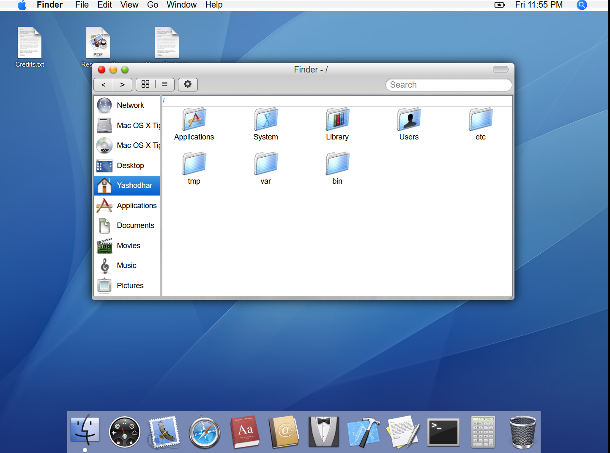

This repository is a complete, working recreation of **macOS X Tiger (10.4)**. It’s not a static UI mock — it’s a functioning OS simulation you can run in the browser, with a virtual file system, multi-window management, a working Terminal, Finder, Safari (PDF viewer), Dashboard, Dictionary + Thesaurus, Mail, Spotlight, and more.

---

## Table of Contents

- [macOS X Tiger (10.4) — Recreated in React](#macos-x-tiger-104--recreated-in-react)
  - [Table of Contents](#table-of-contents)
  - [About](#about)
  - [Highlights](#highlights)
    - [Boot Screen](#boot-screen)
  - [Applications](#applications)
    - [Finder](#finder)
    - [Desktop](#desktop)
    - [Dashboard](#dashboard)
    - [Mail](#mail)
    - [Safari](#safari)
    - [Dictionary \& Thesaurus](#dictionary--thesaurus)
    - [Contacts](#contacts)
    - [Xcode (Viewer)](#xcode-viewer)
    - [TextEdit](#textedit)
    - [Terminal](#terminal)
      - [Supported commands (with syntax)](#supported-commands-with-syntax)
    - [Calculator](#calculator)
    - [Bin / Trash](#bin--trash)
    - [Spotlight Search](#spotlight-search)
  - [Installation](#installation)
  - [Usage \& Development Notes](#usage--development-notes)
  - [Virtual File System](#virtual-file-system)
    - [Example structure (simplified)](#example-structure-simplified)
    - [Design notes](#design-notes)
  - [Screenshots](#screenshots)
  - [Contributing](#contributing)
  - [License \& Author](#license--author)
  - [Footer / About the Author](#footer--about-the-author)

---

## About

This project was built to faithfully reproduce the look, feel, and behaviors of macOS X Tiger (10.4). It includes:

* A dynamic `fileSystem.js` that holds the virtual file tree
* Finder with native-like icons (converted from `.icns → .ico → .avif`)
* Apps that open files from the virtual file system (TextEdit for text, Safari for PDFs)
* A realistic Boot Screen that overlays while the app initializes
* Terminal with many common commands, including wildcard support
* Spotlight (global search) and other system behaviors

---

## Highlights

* Pixel-perfect UI components (icons, widgets, and controls)
* Multi-window management, z-indexing, drag & drop, context menus
* Auto-save for TextEdit, PDF viewer in Safari, code viewer (Xcode)
* Localized dataset stored in `fileSystem.js` for easy editing
* Performance optimizations: boot overlay & lazy loading strategies

### Boot Screen


---

## Applications

Below are short descriptions of each application included in the OS.

---

### Finder


Finder is a full-featured file manager backed by a dynamic JavaScript object (`fileSystem.js`).

**Features:**

* Real Tiger icons (converted and stored in `/assets`)
* Recursive folder tree and search
* Double-click to open files (TextEdit for text files, Safari for PDFs)
* Create New File / New Folder / New Burn Folder via context menu
* Inline rename on creation with input auto-focus & duplicate checks
* Sidebar tabs: Desktop, Documents, Applications, Users, System

---

### Desktop

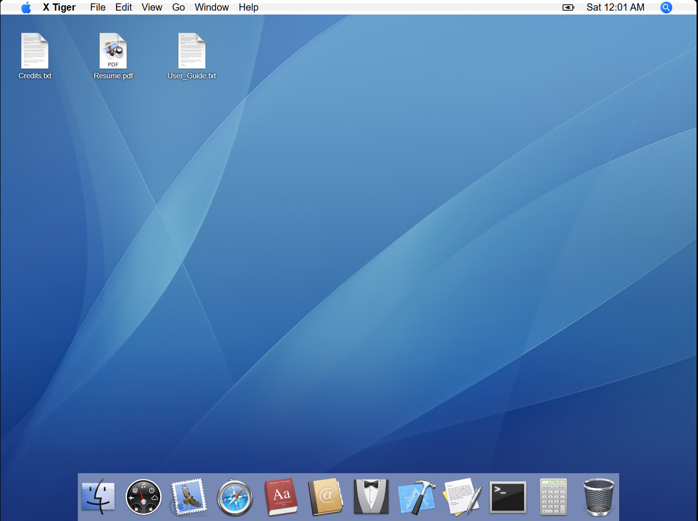

* 45-slot grid layout for icons
* Persistent icon positions across renders
* Create files/folders from the desktop context menu
* Drag to Trash for deletion

---

### Dashboard


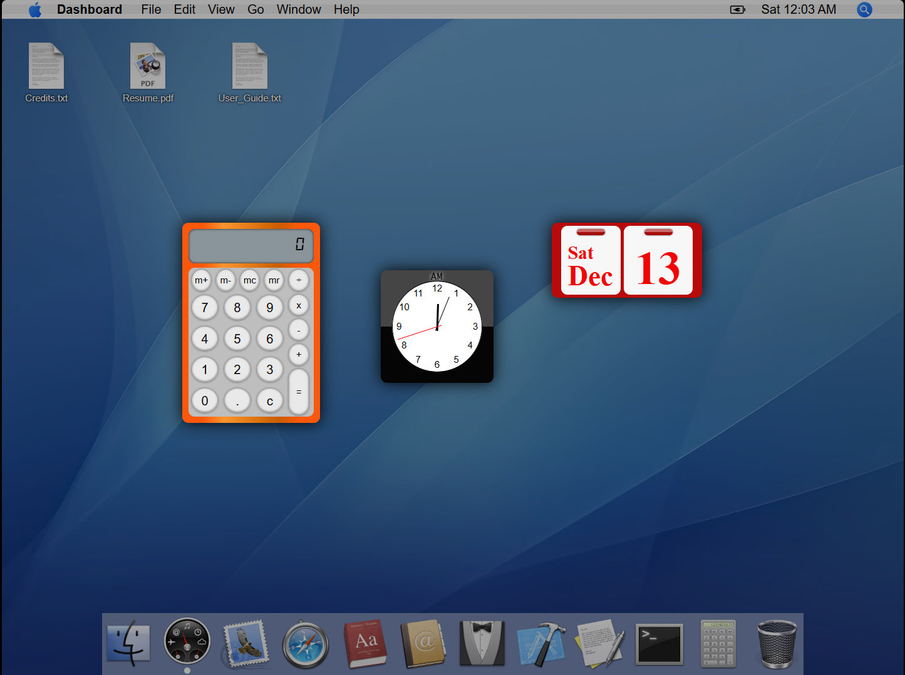

Includes:

* **Calculator** (pixel-perfect metallic UI)
* **Clock** (analog with smooth animation)
* **Calendar** (toggle full-month and compact views)

---

### Mail

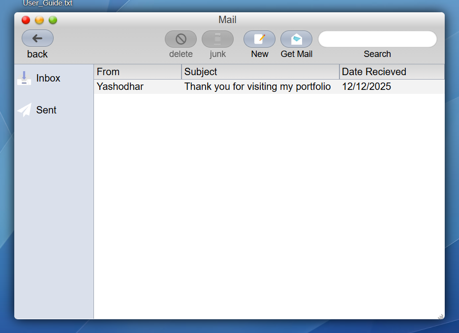


* Basic Inbox & Sent folders
* Search with highlight in email listing
* Expandable, detailed email view
* “New Mail” triggers a small notification (placeholder for compose)

---

### Safari

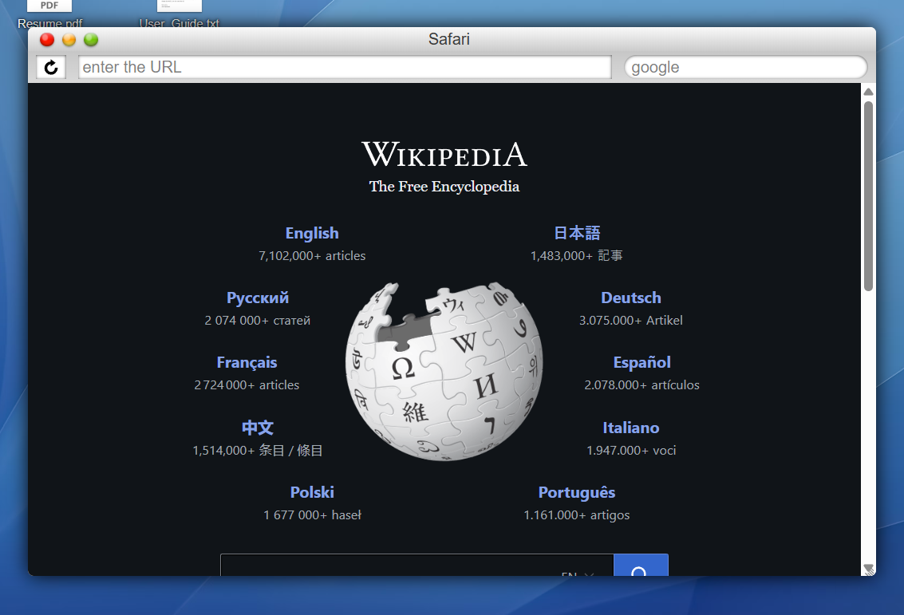

* Default homepage: Wikipedia
* URL bar, search bar, reload button
* PDFs in the virtual file system open in Safari (iframe-based PDF viewer)
* Classic visual styling and toolbar

---

### Dictionary & Thesaurus

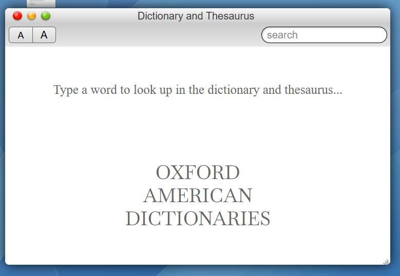

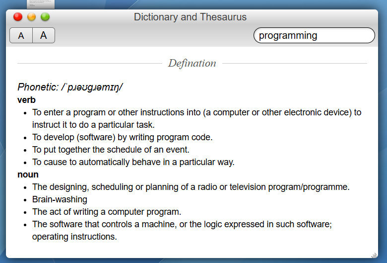

* Definitions & phonetics from `dictionaryapi.dev`
* Synonyms & antonyms sourced from Datamuse (no API key required)
* Live suggestions while typing
* Font-size control for readability
* Consistent centered HR separators for sections

---

### Contacts

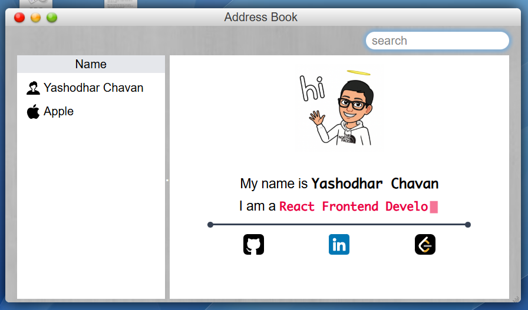

* Custom contact card (name, email, GitHub, LinkedIn, LeetCode placeholder)
* Typing effect to highlight the author
* Search with highlighting within contact list

---

### Xcode (Viewer)


* Read-only source code viewer powered by GitHub fetches
* Tree-like file explorer
* Click to open file contents inline

---

### TextEdit

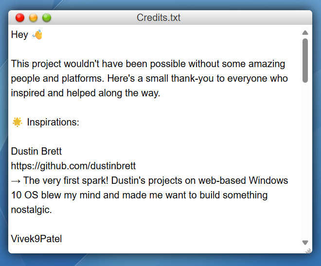

* Opens `.txt`, `.md`, `.html`, `.css`, `.js`, and other non-PDF files
* Auto-save behavior writes content back into `fileSystem.js` (in-memory)
* Simple toolbar and formatting preserved in a lightweight editor

---

### Terminal

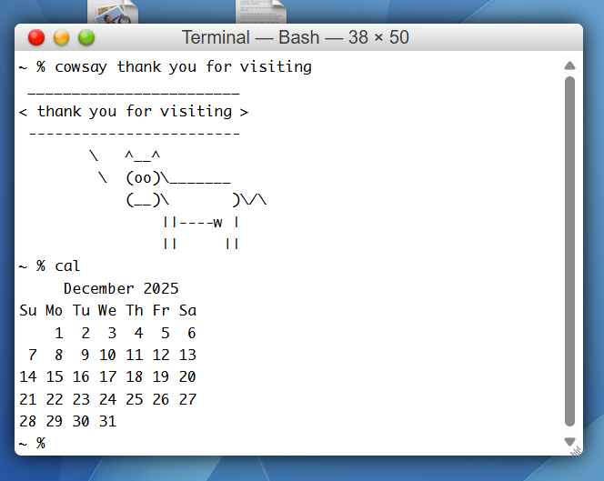
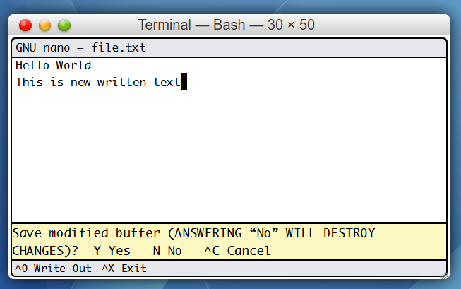

A working, in-browser terminal simulation supporting wildcards, flags, and many utilities. The terminal interprets commands against the virtual file system.

#### Supported commands (with syntax)

| Command   | Syntax                 | Description                                  |
| --------- | ---------------------- | -------------------------------------------- |
| `pwd`     | `pwd`                  | Print current working directory              |
| `ls`      | `ls [pattern]`         | List directory contents (supports wildcards) |
| `cd`      | `cd <dir>`             | Change directory                             |
| `cat`     | `cat <file>`           | Display file content                         |
| `nano`    | `nano <file>`          | Open file in nano editor                     |
| `write`   | `write <file> <text>`  | Create/overwrite file                        |
| `append`  | `append <file> <text>` | Append to file                               |
| `mkdir`   | `mkdir <dir>`          | Create directory                             |
| `touch`   | `touch <file.ext>`     | Create empty file                            |
| `rm`      | `rm <file>`            | Remove file                                  |
| `rmdir`   | `rmdir [-f] <dir>`     | Remove directory                             |
| `cp`      | `cp <src> <dest>`      | Copy file                                    |
| `mv`      | `mv <src> <dest>`      | Move/rename file                             |
| `echo`    | `echo <text>`          | Print text                                   |
| `tree`    | `tree`                 | Show folder structure                        |
| `date`    | `date`                 | Show date/time                               |
| `fortune` | `fortune`              | Random quote                                 |
| `cowsay`  | `cowsay <msg>`         | ASCII cow                                    |
| `cal`     | `cal`                  | Calendar                                     |
| `head`    | `head [-n num] <file>` | First lines                                  |
| `tail`    | `tail [-n num] <file>` | Last lines                                   |
| `wc`      | `wc <file>`            | Line/word/char count                         |
| `man`     | `man`                  | Help                                         |
| `clear`   | `clear`                | Clear terminal                               |
| `exit`    | `exit`                 | Close terminal                               |

---

### Calculator

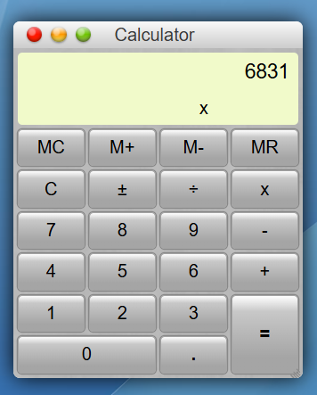

* Metallic UI matching macOS Tiger
* Full arithmetic support

---

### Bin / Trash


* Drag files to delete
* Icon toggles empty/filled

---

### Spotlight Search


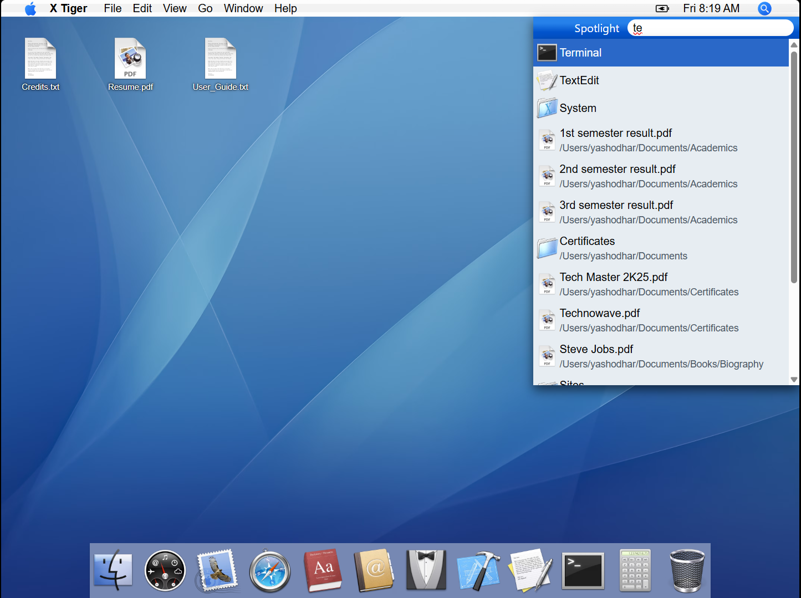

* Global recursive search
* Keyboard friendly
* Enter to open result

---

## Installation

```bash
git clone https://github.com/YashodharChavan/yashodharchavan.github.io.git
cd yashodharchavan.github.io
npm install
npm run dev
```

---

## Usage & Development Notes

* Virtual FS lives in `src/components/Utils/fileSystem.js`
* PDFs must be hosted via GitHub Pages or CDN
* Boot overlay improves perceived load time
* Icons converted from original `.icns`

---

## Virtual File System

The entire OS is powered by a **recursive, in-memory virtual file system**, implemented as a plain JavaScript object (`fileSystem.js`).

Each node in the tree is one of:

* `dir` — directory (with `children`)
* `file` — text or binary file
* `app` — application bundle
* `file` with `href` — externally hosted PDFs or documents

All core features — **Finder, Desktop, Terminal, Nano, Safari, Spotlight** — operate directly on this shared data structure.

### Example structure (simplified)

```text
/
├── Applications
│   ├── Finder.app
│   ├── Safari.app
│   ├── Terminal.app
│   └── TextEdit.app
│
├── Users
│   └── yashodhar
│       ├── Desktop
│       │   ├── Credits.txt
│       │   └── Resume.pdf
│       ├── Documents
│       │   ├── Academics
│       │   ├── Certificates
│       │   └── Books
│       └── file.txt
│
├── bin
│   ├── ls
│   ├── cat
│   ├── nano
│   └── exit
│
└── System
```

### Design notes

The structure closely mirrors classic UNIX/macOS layouts
- Directories are recursively traversable
- File creation, deletion, and modification update the same shared state
- Terminal commands (ls, cd, rm, nano, etc.) operate directly on this tree
- Finder and Desktop instantly reflect changes made via Terminal (and vice versa)


---

## Screenshots

Images stored in `/screenshots/`.

---

## Contributing

Issues and PRs welcome.

---

## License & Author

**Author:** Yashodhar Chavan
**License:** MIT

---

## Footer / About the Author

Built with ❤️ and obsessive attention to pixel detail.

---
