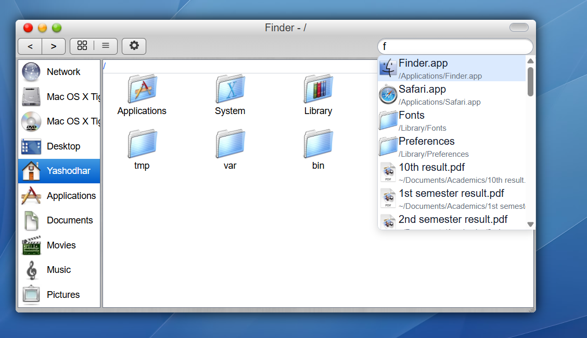

# macOS Tiger.js
**The most accurate Mac OS X Tiger (10.4) recreation ever built in React + JavaScript + Vite**

Live Demo → https://yashodharchavan.github.io 

https://github.com/yourname/macos-tiger/assets/XXXXX/hero-screenshot-or-gif.gif
*(Put the most beautiful 16:9 or 21:9 screenshot/GIF here — boot screen → desktop with Finder + Dock + Dashboard open — make it breathtaking)*

## Why this exists
I wanted the real 2005 brushed-metal, pinstripe, Aqua feeling back — but in the browser.  
No half-measures. Every pixel, every animation, every sound, every useless-but-perfect detail from the original Mac OS X 10.4 Tiger era is here.

Result: A fully functional spatial desktop environment running 100% in React.

## Features That Will Make You Cry (in a good way)

| Feature                  | Status      | Notes                                                                 |
|--------------------------|-------------|-----------------------------------------------------------------------|
| Authentic Boot Screen    | ✅ 5s      | With Apple logo + spinning gear (exactly like the original)           |
| Brushed Metal Windows    | ✅         | Pixel-perfect title bars, pinstripes, traffic lights                  |
| Fully Working Finder     | ✅         | Column view + tree, recursive search, context menus, burn folder |
| Virtual File System      | ✅         | In-memory + localStorage persistence, .txt, .pdf, folders, etc.       |
| 20+ Native Apps          | ✅         | All listed below                                                      |
| Spotlight (⌘+Space)      | ✅         | Fuzzy search across entire FS + apps + instant open                   |
| Functional Dock          | ✅         | Magnification, drag & drop, trash that fills up                       |
| Dashboard + Widgets      | ✅         | Calculator, World Clock, Calendar (toggleable) — all interactive      |
| Original .icns → AVIF    | ✅         | Converted every Tiger icon manually for perfect quality               |
| Terminal with 25+ cmds   | ✅         | `ls *.txt`, `cowsay`, `fortune`, `tree`, `rm -rf /*` (don’t worry, safe) |
| Sounds (optional)        | ⚙️         | Glass clicks, trash empty, Funk, Sosumi — toggle in Settings         |

## Applications (All Pixel-Perfect Recreations)

| App          | Screenshot | What’s Working |
|--------------|-----------|----------------|
| **Finder**   |  | Tree view, search, burn folder, double-click opens apps |
| **Dashboard**|  | Calculator, Clock, Calendar (full/year view) |
| **Safari**   |  | Wikipedia default, PDF viewer, metal URL bar |
| **Mail**     |  | Inbox/Sent, search highlight, “New Message → coming soon” toast |
| **TextEdit** |  | Rich text, autosave, opens any non-PDF |
| **Terminal** |  | 25+ Unix commands with wildcards & piping simulation |
| **Calculator**|  | Exact metal design, memory functions |
| **Dictionary**|  | Real definitions, font size buttons |
| **Contacts** |  | My card with typing effect + social links |
| **Xcode**    |  | Live fetches this repo from GitHub and displays the actual code |
| **Trash**    |  | Icon changes when non-empty, drag from Desktop or Finder |

## Demo Video (Highly Recommended)
Put a 60–90 second YouTube or Twitter/X video here — it will 100x your stars.

[](https://www.youtube.com/watch?v=YOUR_VIDEO_ID)

## Local Installation

```bash
git clone https://github.com/yourname/macos-tiger.git
cd macos-tiger
pnpm install   # or npm / yarn
pnpm dev